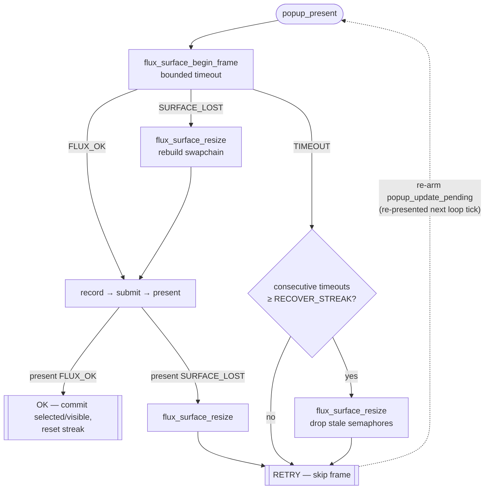

# ADR-0006: Resilient Candidate-Popup GPU Present

- **Status**: Accepted
- **Date**: 2026-05-28
- **Deciders**: Project maintainers

## Context

The candidate popup presents a flux (Vulkan) swapchain directly onto its `zwp_input_popup_surface_v2` `wl_surface`. Per [ADR-0004](0004-event-loop-scheduling-and-watchdog.md), the render is deferred — input callbacks set `popup_update_pending` and the render is flushed once per loop iteration — but that flush, including the GPU present, runs synchronously on the single-threaded event-loop thread (the `POPUP_UPDATE` watchdog stage).

The swapchain uses vsync (FIFO) present mode. With an infinite acquire timeout, both `vkWaitForFences` and `vkAcquireNextImageKHR` could wait with `UINT64_MAX`.

After a screen lock, DPMS-off, or system suspend/hibernate the compositor stops releasing the popup surface's swapchain images. The next acquire blocks indefinitely and freezes the entire loop. Because key events queue on the Wayland fd while the loop is blocked, they are processed in order once it unblocks — so candidate **selection stays correct** while the **visible highlight is frozen/laggy**. The committed selection is right; only the visible cursor lags.

The stall persisted after resume because the only swapchain-recovery path (`FLUX_ERROR_SURFACE_LOST` → `flux_surface_resize`) fires only when the driver reports `VK_ERROR_OUT_OF_DATE_KHR` / `VK_SUBOPTIMAL_KHR`. A compositor that is merely slow to release buffers raises no error, so nothing rebuilds the swapchain.

## Decision

Bound the popup's GPU present so a stalled compositor can never block the loop:

1. `flux_surface_begin_frame` is called with a bounded timeout (`POPUP_PRESENT_TIMEOUT_NS`, ~32 ms ≈ 2 vblanks @60 Hz). The per-frame `in_flight` fence is created signalled and the healthy on-demand path acquires instantly, so this budget is only consumed by a genuine stall.
2. On timeout the frame is skipped (`POPUP_PRESENT_RETRY`): `selected` / `visible` are left unchanged and `popup_update_pending` is re-armed so the loop re-presents the same state until presentation resumes.
3. After `POPUP_PRESENT_RECOVER_STREAK` consecutive timeouts the swapchain is recreated via `flux_surface_resize` to the current extent. This discards stale per-frame semaphores and recovers cleanly once the session is back. `vkDeviceWaitIdle` inside resize waits only on GPU work (which completes regardless of presentation) so it does not block.
4. flux reports an acquire `VK_TIMEOUT` / `VK_NOT_READY` as `FLUX_ERROR_TIMEOUT` (previously misclassified as `FLUX_ERROR_BACKEND_FAILURE`) so the caller can distinguish a transient stall from a real backend failure.

vsync (FIFO) is retained; the bound — not the present mode — is what guarantees loop responsiveness.

## Alternatives considered

- **Keep the infinite-timeout present.** Rejected: couples loop liveness to compositor buffer release, so a lock/suspend freezes the UI of a daemon that holds the keyboard grab.
- **Switch the popup to non-vsync (MAILBOX/IMMEDIATE).** Considered. Lowers per-present latency but does not by itself fix the stall — acquire can still block when the compositor holds every image. The bounded timeout is the actual fix; present mode is orthogonal.
- **Render the popup on a dedicated thread.** Rejected, consistent with [ADR-0004](0004-event-loop-scheduling-and-watchdog.md)'s rejection of thread-per-subsystem. Wayland and flux surface state are driven from the loop thread; cross-thread surface access would add locking and protocol-sequencing risk for little gain on a tiny, low-frequency surface.

## Consequences

- Positive: a stalled, asleep, or occluded compositor bounds each present to the timeout instead of blocking forever; key handling and the loop stay responsive through lock/suspend, and the popup self-recovers after resume with no user action.
- Positive: complements [ADR-0004](0004-event-loop-scheduling-and-watchdog.md)'s watchdog — the `POPUP_UPDATE` stage can no longer hang the loop, so it cannot trip a false stuck-stage alarm.
- Trade-off: during an active stall the visible highlight lags by up to the retry cadence (bounded by the ~100 ms poll timeout); the committed selection is correct throughout.
- Trade-off: behaviour depends on the matching flux change that maps acquire timeout to `FLUX_ERROR_TIMEOUT`; the host and flux checkouts must stay in sync.
- Negative (accepted): the timeout and recovery-streak thresholds are heuristic constants.
