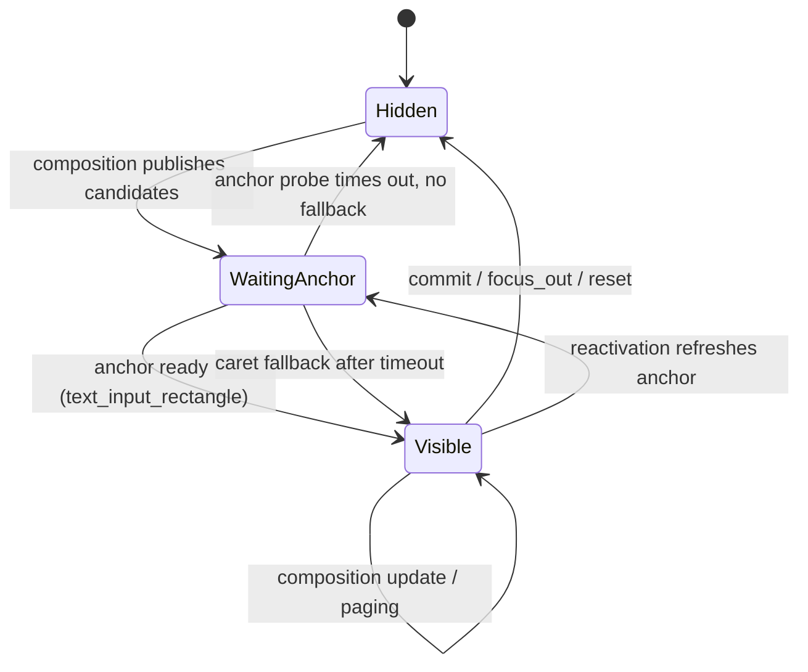

# Candidate Panel Behavior

This document describes the **UI-level lifecycle of the candidate
box**: what the user sees, when the box appears and disappears, how
input maps to visible state, and how the box behaves when the
compositor or engine stalls. It is the user-behavior counterpart to
[Panel Architecture](panel-architecture.md), which covers multi-owner
arbitration, and [Frontend Graphics](frontend-graphics.md), which
covers the render pipeline.

The vocabulary follows [ADR-0014](../adr/0014-canonical-panel-vocabulary.md):
**Panel** is the floating IME surface as a whole; **Candidate Zone**
is the region that lists the engine's candidates. "Candidate window"
is a user-facing prose synonym, not a code identifier.

## What the user sees

When the Panel is owned by composition, it shows up to three regions:

| Region | Contents | Driven by |
|---|---|---|
| **Preedit Zone** | The in-flight composition string, rendered inline with a thin caret at the engine-reported byte offset. | `TypioComposition.segments` + `TypioComposition.cursor_pos` |
| **Candidate Zone** | A vertical list of candidates with a muted index label (`1`…`9`, `0`) before each entry. The selected candidate is highlighted. | `TypioComposition.candidates` + `TypioComposition.selected` |
| **Mode divider** | An optional accent-coloured line marking the engine's active mode (e.g. latin / cjk). | Engine-declared mode label |

The Preedit Zone and the Candidate Zone can update independently: a
pinyin engine after one keystroke shows preedit with no candidates; a
completion engine may show candidates with empty preedit.

## Lifecycle states

The Candidate Zone of the Panel moves through four logical states.

### Hidden

No Panel surface is mapped. The compositor is not asked to position
anything. The host keeps draining keyboard events normally; if the
engine emits a non-empty composition, the lifecycle restarts at
`WaitingAnchor`.

### Waiting for anchor

The engine has produced candidates, but the compositor has not yet
provided a trustworthy placement rectangle for the current activation.
The host sends an **anchor probe** — an empty preedit followed by a
no-op `commit(serial)` — to make browsers and other clients that
refresh caret rectangles on input-method traffic send a fresh
`text_input_rectangle`. The probe is bounded by
`display.anchor_probe_timeout_ms` (default 150 ms, clamped 50–1000 ms).

If the anchor becomes ready within the timeout, the Panel maps and the
state becomes `Visible`. If the timeout expires, the host applies the
**caret fallback**: if the compositor has *ever* sent a caret rectangle
for this activation, that cached rectangle is trusted; otherwise the
update is discarded and the state returns to `Hidden`.

### Visible

The Panel surface is mapped near the caret. Each new composition
callback repaints the Candidate Zone without re-arming the anchor
probe: paging, selection movement, and preedit edits all flow through
the same paint path. The host marks the Panel dirty and the event
loop flushes the redraw on the next tick.

### Hidden again

The Candidate Zone is torn down when any of these happens:

- The engine commits a candidate (`typio_input_context_commit_callback`
  fires).
- The input context loses focus (`focus_out` is applied).
- The engine resets (`typio_input_context_reset`) — e.g. on a soft
  pause or resume-from-suspend hard boundary.
- A composition callback arrives with empty preedit **and** empty
  candidates.

Tearing the Panel down detaches the wl_buffer so no stale popup shadow
remains beside the caret.

## How input maps to visible state

The host and the engine share responsibility for navigating the
Candidate Zone. The split is governed by the engine's declared
**host-managed-selection flags** in `TypioComposition.host_managed_selection`
(see `candidate_guard.rs`):

| Flag | Keys the host intercepts | Visible effect |
|---|---|---|
| `NAVIGATE` | Up / Down / Left / Right | Moves the highlighted candidate by one, clamped at the list edges. |
| `COMMIT` | Space | Commits the currently highlighted candidate. |
| `INDEX_PICK` | `1`…`9`, `0` | Commits the candidate at that index directly. |
| `COMMIT_RAW` | Enter / KP_Enter | Commits the preedit as-is, ignoring candidate selection. |

When the engine declares no flags at all, the host still intercepts
the arrow keys as long as candidates exist — the historical default
that keeps arrow navigation working in engines that pre-date the flag
contract. Number keys, Space, and Enter then fall through to the
engine's own `process_key`.

Index-pick keys are filtered against the actual candidate count: a
`6` keypress with only four candidates is forwarded to the engine
rather than swallowed, so the engine can interpret it (e.g. as a
literal digit in the preedit).

## Position and anchor

The Panel is placed by the compositor near the text-input rectangle.
The host does not own global caret coordinates; it depends on the
compositor sending `zwp_input_popup_surface_v2.text_input_rectangle`
for the active `zwp_input_popup_surface_v2` role.

Each focus activation receives a fresh **anchor generation**. The
generation becomes *ready* when either:

1. The compositor sends `text_input_rectangle` for the current
   activation, **or**
2. The Candidate Zone successfully presents for the current
   activation.

The second path exists because candidates are input-driven: browsers
such as Firefox and Chrome frequently update caret rectangles only
after real input-method traffic, so the candidate Panel usually
appears in the right place even when out-of-band indicator UI does
not. A successful first present retroactively marks the anchor
trustworthy for any subsequent positioned UI in the same activation.

Reactivation (clicking between two text fields in the same window)
refreshes the anchor generation: the host re-sends the probe and
the Candidate Zone waits for a fresh rectangle rather than reusing
the previous field's position.

## What the user sees during stalls

A frozen or slow compositor does not corrupt committed text. Input
events continue to queue on the Wayland fd while a frame is skipped,
so navigation and selection stay correct even when the visible
highlight briefly lags behind. This is the central design property
established in [ADR-0006](../adr/0006-resilient-candidate-popup-present.md)
and revisited in [Frontend Graphics](frontend-graphics.md#a-corollary-graphics-and-input-correctness-are-decoupled).

When `vkQueuePresentKHR` or `vkAcquireNextImageKHR` blocks because the
compositor is not releasing swapchain images — display asleep, surface
occluded, compositor stalled — the panel scheduler enters the `Retry`
state:

1. The current present returns `PanelUpdateResult::Retry`; the
   Panel's `selected` / `visible` fields are **not** updated.
2. The event loop poll timeout is shortened to
   `RETRY_POLL_MS` (16 ms) so the scheduler keeps retrying at
   vsync cadence without waking the loop excessively.
3. After `PANEL_PRESENT_RECOVER_STREAK` consecutive timeouts the
   swapchain is rebuilt via `flux_surface_resize`, discarding the
   per-frame semaphores left dangling by the stalled acquires.
4. The watchdog's `PanelUpdate` stage tolerates up to 15 s before
   treating the loop as hung, so legitimate present stalls do not
   trigger a `SIGKILL`.

The visible effect to the user is that the highlight briefly freezes
during the stall and then jumps to the correct candidate when the
compositor resumes; the committed text on `commit(serial)` reflects
whatever the user actually selected, not what was visually highlighted
at the moment of the stall.

## Configuration

The candidate-panel behavior is tuned through `display.*` keys in
`core.toml`. The full option table is in
[Configuration Reference](../reference/configuration.md); the keys
that directly affect candidate-box behavior are:

| Key | Default | Effect |
|---|---|---|
| `display.anchor_probe` | `true` | Sends an empty-preedit + commit probe to refresh the caret rectangle on activation. Disable for compositors that handle no-op commits poorly. |
| `display.anchor_probe_timeout_ms` | `150` | Maximum wait for a fresh `text_input_rectangle` before applying the caret fallback or dropping the update. Clamped to 50–1000 ms. |

Theme keys (`display.colors.light.*`, `display.colors.dark.*`) and
font keys (`display.font.*`) affect appearance but not lifecycle; see
[Panel Appearance](../dev/panel-appearance.md).

## Source map

| Responsibility | Source |
|---|---|
| Composition callback → `(preedit, cursor_pos, candidates, selected)` slot | `crates/typio-host/src/keyboard/router.rs` |
| Inline preedit cursor resolution | `crates/typio-host/src/preedit.rs` |
| Host-managed-selection key interception (pure rules) | `crates/typio-host/src/candidate_guard.rs` |
| Owner arbitration + anchor generation + caret fallback | `crates/typio-host/src/panel_coordinator.rs` |
| Panel dirty/retry schedule state | `crates/typio-host/src/panel_scheduler.rs` |
| Preedit/panel sync plan and positioned-UI timeout | `crates/typio-host/src/text_ui_state.rs` |
| Focus effects pipeline (clear_preedit, focus_out, reset) | `crates/typio-host/src/session_glue.rs`, `crates/typio-host/src/focus_controller.rs` |
| Vulkan swapchain present + retry/recover | `crates/typio-host/src/panel.rs` |
| Per-stage watchdog thresholds (`PanelUpdate`, `Present`) | `crates/typio-host/src/watchdog.rs` |

## See also

- [Panel Architecture](panel-architecture.md) — multi-owner arbitration, anchor probe overview
- [Frontend Graphics](frontend-graphics.md) — render pipeline, GPU independence argument
- [Panel Appearance](../dev/panel-appearance.md) — fonts, theme, layout cache invalidation
- [Wayland Input Method Protocol](wayland-input-method.md) — protocol-layer events and serial chokepoint
- [Input-Method Session](input-method-session.md) — focus_in / focus_out / reactivate lifecycle
- [ADR-0006](../adr/0006-resilient-candidate-popup-present.md) / [ADR-0010](../adr/0010-non-blocking-candidate-popup-present.md) — present-side resilience
- [ADR-0014](../adr/0014-canonical-panel-vocabulary.md) — Panel / Zone / popup vocabulary
- [ADR-0017](../adr/0017-positioned-ui-arbitration.md) — owner arbitration rules
- [ADR-0022](../adr/0022-panel-retry-result-owned-by-update.md) / [ADR-0023](../adr/0023-panel-scheduler-state-machine.md) — retry result and scheduler state machine
